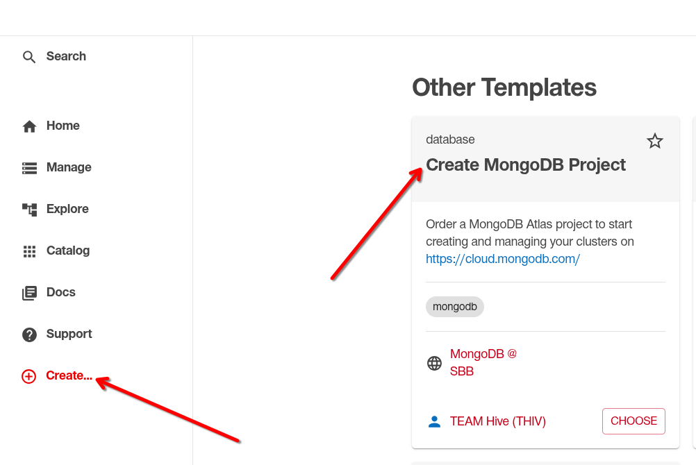
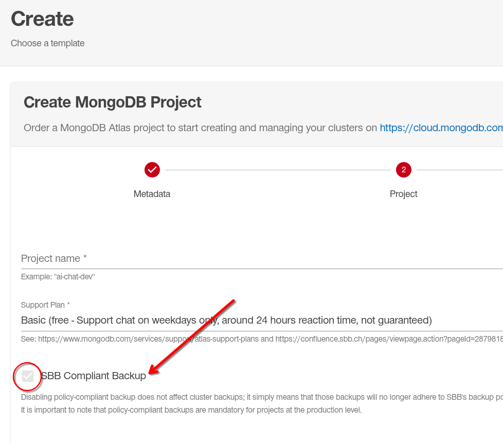
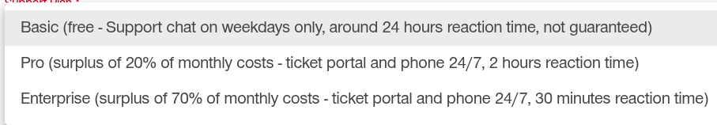
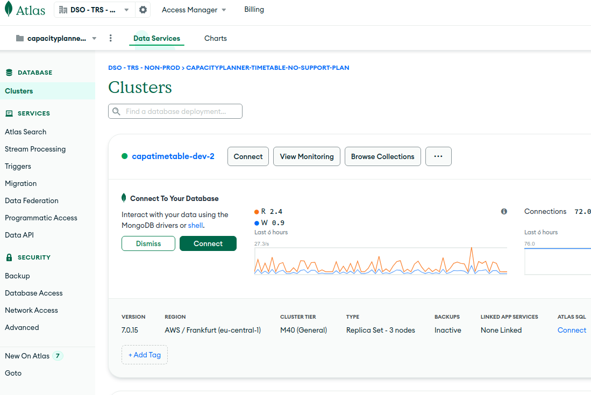
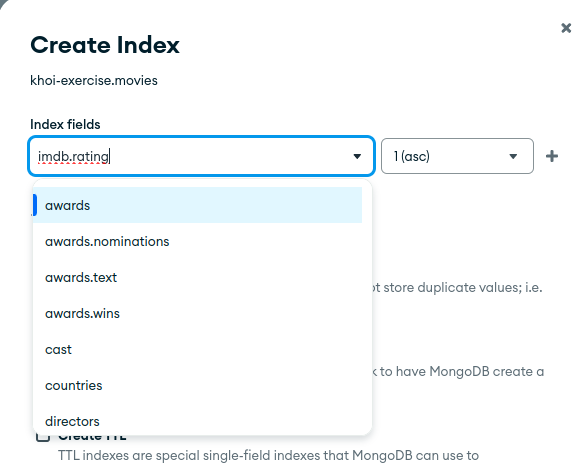
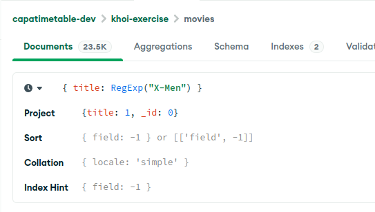

# MongoDB Introduction: Part 1

---

## Agenda

### MongoDB

- Terminology
- MongoDB Atlas
- MongoDB Compass
- Collections, Dokumente, Indexes
- Query-Language MQL
- Aggregations
- Explains

---

### Java / Spring Specific

- Transactions
- SpringData MongoDB
- Native Queries
- MongoTemplate

---

## Team Hive SSP Portal

https://backstage.sbb-cloud.net/



---

## DB Policy!



---

## Support plan



---

## Terminology around MongoDB

MongoDB Atlas Specific terminology

<figure class="mermaid" style="transform: scale(0.7)">
erDiagram
    "Organisation (Atlas only)" ||--o{ "Project (Atlas only)" : ""
    "Project (Atlas only)" ||--o{ "Cluster (Atlas only)" : ""
    "Cluster (Atlas only)" || --o{ Database : ""
    Database || --o{ Collection : ""
    Collection || --o{ Document : ""
    Collection || --o{ Index : ""
</figure>

---

## Examples

- Organisation  (Created by HIVE Team):
  - SBB Basic Support 1
  - SBB Pro Support 1

---

## Examples 2

- Clusters (Created by us):
  - capatimetable-dev-2
  - capatimetable-test-unsharded

- Database (Created by us):
  - capacity-object-dev-v28
  - capacity-object-test-v28

- Collection (Created by Spring Data `@Document`):
  - pathOccupancy
  - pathDemand

- Indexes (Created by Spring Data `@CompoundIndex` / `@Indexed`)

Example:

https://code.sbb.ch/projects/TP_TMS_CAPAPLANNER/repos/capaorder-capacity-order/browse/src/main/java/ch/sbb/tms/capaplanner/order/capacityorder/capacity/planningorder/CapacityPlanningOrderStatusSummary.java#22

---

## Terminology comparison

|Term|SQL Equivalent|
|---|---|
|Cluster|(Postgres) Server|
|Database|Database|
|Collection|Table|
|Document|Row|
|Index|Index|

---

## DEMO Part 1



[MongoDB Atlas](https://cloud.mongodb.com/v2/6576c3566c0a037fa40a945d#/overview)

---

# MQL (MongoDB Query Language)

---

## What is a query in MongoDB?

A MongoDB query roughly JSON.

### MongoDB Extended JSON v2

Most types are inferred, but if you need more control, i.e. DateTime formats

https://www.mongodb.com/docs/manual/reference/mongodb-extended-json/

### mongosh

https://www.mongodb.com/docs/mongodb-shell/reference/data-types/

---

## Simplest possible query

Is a empty JSON document:

`{}`

Is the equivalent to `SELECT * FROM <collection>`

---

## General Query Syntax

```js
{ 
    <field1>: { <operator1>: <value1>, ... },
    <field2>: { <operator2>: <value2>, ... },
    ...
}
```

### Example
```js
{
    _id: { $eq: "2026_14194-001_2026-09-18-4806_2025-12-14-CAPACITY_PLAN_LEGACY" }
}
```

---

## Operators

https://www.mongodb.com/docs/manual/reference/operator/query/

### Most used operators

Comparison:

`$eq`, `$ne`, `$gt`, `$lt`, `$gte`, `$lte`, `$in`, `$nin`

Evaluation:

`$regex`

Logical:

`$and`, `$or`

Element:

`$exists`

Array:

- `$all` : All elements in array must match
- `$elemMatch`: At least one element must match

---

## Useful shorthands

### `$eq`
```js
{
    _id: "1234"
}
```

Equality is the default operator.


### `$regex`
```js
{
    _id: /bandits/
}
```


---

## Querying nested fields / subdocuments

Nested fields can be queried using the "dot" notation:

```js
{
    "topologyState.topologyKnowledgeStateId": 4800
}
```

**Don't forget the quotes!**

---

# Exercise block: Movie Database

---

## Exercises

1. Movies released in the year 1977
2. Movies between 1977 and 1982. *Hint: use multiple operators*
3. Movies that contain 'Star Wars' in the title. *Hint: use $regex or shorthand regex*
4. Movies that have at least 9.0 imdb rating. *Hint: $gte*
5. Movies that have the `Sci-Fi` genre. *Hint: you can query Arrays directly*
6. Movies that have the `Sci-Fi` or `Mystery` genre. *Hint: use the $in operator*

---

# Aggregations

---

## What are aggregations NOT?

* They are NOT SQL Aggregations (aka GROUP BY ... HAVING ...).
* They are NOT SQL Joins

... but they can be used as such.

---

## What are aggregations?

Imagine them being pipeline of actions.

Here is the main workflow:

1. Query some data using (`$match` pipeline)
2. Do something with the data: `$group`, `$project`, ...
3. Do something with the data: `$group`, `$project`, ...
4. ...
5. return data

---

## Pipepline stages

- 100 MB per pipeline stage
- max 100. pipeline stage
- Indexes can be used in `$match`, `$group`, `$sort`, `$lookup`

---

## Most used aggregation pipelines

https://www.mongodb.com/docs/manual/reference/operator/aggregation-pipeline/

### `$match`

Filters documents using MQL.

Example:

```js
{
    title: "X-Men"
}
```

---

### `$project`

Select fields to show in the output.

Example:

```js
{
    _id: 0,
    title: 1
}
```

Only show titles, no `_id` (`_id` is included by default)

---

### `$group`

Groups documents. Can also be used for finding disctinct documents.

Example:

```js
{
    _id: "$year",
    titles: {
        $addToSet: '$title'
    }
}

```

"Make a document for each year, with an array of titles".

---

### `$unwind`

"Unwinds" / Flattens an array.

`["Foo", "Bar"]` will result in two documents `"Foo"` and `"Bar"`

```js
{
    _id: "$year",
    titles: {
        $addToSet: '$title'
    }
}
```

---

### `$bucketAuto`

Put documents into buckets automatically (also see `$bucket`).

```js
{
    groupBy: '$imdb.rating',
    buckets: 3,
    output: {
        titles: { $addToSet: '$title' }
    }
}
```

---

# Aggregation Exercise

---

## Exercise

Count all movies by genre.

Hint:

* Use `$unwind` stage to split the `genres` array.
* Use `$group` stage to group by genre.
* Use `$sum: 1` to count in the group stage


---

# Explains

## DEMO


---

# Indexes


---

## What are indexes?

Indexes are a data structure to improve the speed of data retrieval.
You can imagine indexes being a index of a book to know which entries are on which page of a book.

---

## Default index

The `_id` of a collection is always indexed.

---

## Index usage

Each query can only use up to 1 index.

---

## Index types

- Single Field Index (created by `@Indexed` in Spring Data MongoDB)
- Compound Index (multi field indexes)
- Multikey Index (array field index)
- Text Index (full text search index)
- Hashed index (hash function index)
- Geospatial Indexes (mainly used for GeoJSON)

https://www.mongodb.com/docs/manual/core/indexes/index-types

---

## Partial indexes

Partial indexes are indexes which index only a subset of documents.

e.g. *I want only a index for all movies with rating > 8*

MongoDB will use partial indexes, if the partial selector is part of the query, or if you specify the index(-name).

## Why partial indexes?

Compound indexes can grow very large in size. Partial indexes can help reduce index sizes.

---

## How to create indexes




```js

db.movies.createIndex(
    {"imdb.rating": 1},
    {
        name: 'rating', 
        partialFilterExpression: '{"imdb.rating": {$gte: 8}}'
    }
);
```


---

## Covered indexes

A single MongoDB query is divided into stages:

1. Query Stage
2. Plan Stage
3. Fetch Stage
4. Projection Stage
5. Sort Stage
6. Limit Stage
7. Return Stage

---

## Covered indexes 2

It is possible to skip the Fetch Stage when you use a covered indexes.

Requirements:
- The index must not have arrays in it
- The cluster must not be sharded
- The projection has only fields that are included in the index

Example: 




---

# MongoDB with Java / Spring / Spring Data

---

## `@Document` Annotation

Java classes with `@Document` Annotation will upon application start:

- Create a the collection
- Create indexes according to `@Indexed` and `@CompoundIndexes` annotation

---

## Repository interfaces

Most Spring Data Query DSL are supported.

```java
public interface MovieRepository extends MongoRepository<Movie, Long> {
    // You can return Streams
    Stream<Movie> findByTitleContainsOrderByTitle(String search);

    // You can query nested fields with _
    List<Movie> findByImdb_RatingGreaterThan(double rating);

    Set<Movie> findByGenresContains(String genre);
}

```

---

## Custom Queries

```java

public interface MovieRepository extends MongoRepository<Movie, Long> {
    @Query("{'imdb.rating': {$gte: ?0}}")
    List<Movie> myCustomQuery(double rating);
}
```

---

## Custom Aggregations

```java
public interface MovieRepository extends MongoRepository<Movie, Long> {
    @Aggregation(pipeline = {
        "{ $match: { 'imdb.rating': { $gte: ?0 } } }",
        "{ $project: { _id: 0, title: 1 } }"
    })
    List<TitleOnly> getTitlesOnlyForRatingGreaterThan(double rating);

    public record TitleOnly(title: String) {};

}

```

---

## Interact directly with MongoDB without Spring Data

Inject `MongoTemplate`

```java

@RequiredArgsConstructor
public class MyService {
    private final MongoTemplate mongoTemplate;

    void someMethod() {
        mongoTemplate.findById("someId", Movie.class);
    }
}

```

---

## Transactions

https://confluence.sbb.ch/display/EARLYTRS/Spring+Transactions+mit+MongoDB